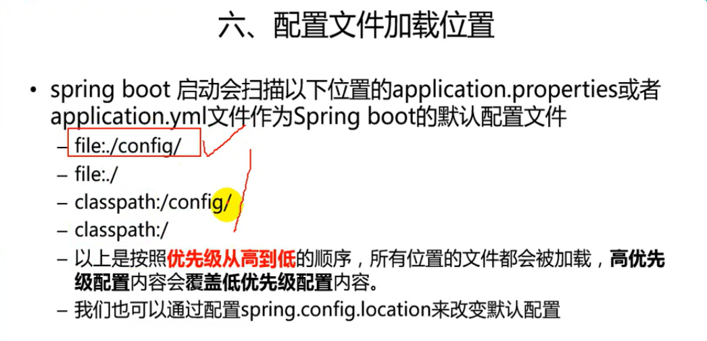
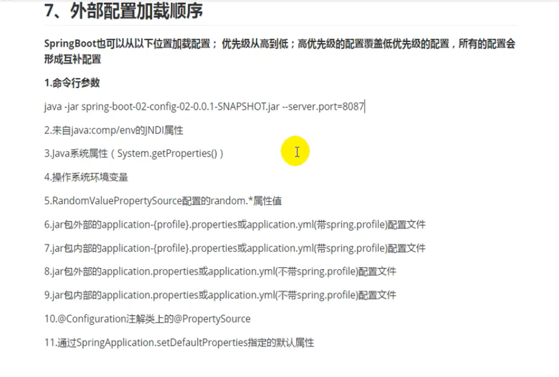

<h1>SpringBoot 学习</h1>
<h3><b>初始化构建：</b></h3>
<ul>
    <li>主配置文件（默认配置文件）：ClassPath路径下的application.properties或
    application.yml文件
        <ul>
            <li>扩展：YAML标记语言。语法：key=(空格)value。</li>
        </ul>
    </li>
    <li>从配置文件中取值的三种方式：
        <ul>
            <li>在类上添加@ConfigurationProperties注解（自动从<b>主配置文件中匹配值</b>）</li>
            <li>在属性上添加@Value("#{1+8}")注解从<b>主配置文件</b>中取值。</li>
            <li>在类上使用@PropertySource(value = {"classpath:person.properties"})注解，
                    从<b>自定义的配置文件</b>中取值。可以配合上面两个注解一起使用。
            </li>
        </ul>
    </li>
    <li>
    @ConfigurationProperties注解和@Value注解取值的差异
    <table>
        <tr>
            <td></td>
            <td>@ConfigurationProperties</td>
            <td>@Value</td>
        </tr>  
         <tr>
              <td>功能</td>
              <td>批量注入配置文件中的属性</td>
              <td>单个注入</td>
         </tr>
         <tr>
               <td>松散绑定（松散语法）</td>
               <td>支持</td>
               <td>不支持</td>
         </tr> 
         <tr>
               <td>SpEL</td>
               <td>不支持</td>
               <td>支持</td>
         </tr> 
         <tr>
               <td>JSR303验证</td>
               <td>支持（类上使用@Validated注解，
               相应的字段加上要匹配格式的注解，例如：@Email验证邮件）</td>
               <td>不支持</td>
         </tr>
         <tr>
               <td>复杂类型封装（list、map等等）</td>
               <td>支持</td>
               <td>不支持</td>
         </tr> 
    </table>
    </li>
    <li>往容器中添加组件的方式：
        <ul>
            <li>配置文件的方式：在主程序（SpringbootApplicationTests）向添加@ImportResource(value = {""})注解，
                value是一个数组，可以设置多个文件的路径</li>
            <li>Java类的方式：类上使用@Configrution注解，方法上使用Bean注解。</li>
        </ul>
    </li>
    <li>配置文件占位符(${}): 
        <ul>
            <li>使用springboot提供的随机数：${random.uuid}..</li>
            <li>获取之前配置的值，若没有则使用设置的默认值。${属性名:默认值}</li>
        </ul>
    </li>
    <li>profile多环境支持(开发环境，测试环境，运行环境等等)
        <ul>
            <li>properties格式文件配置：
                <ul>
                    <li>为每个环境创建一个properti格式的文件，
                        文件命名：application-{profileName}.properties
                    </li>
                    <li>切换环境：默认启动的是application.properties配置的环境，
                        可以通过在application.properties文件中设置
                        spring.profiles.active=profileName来切换环境
                    </li>
                </ul>
            </li>
            <li>yml格式文件配置：
                <ul>
                    <li>在application.yml文件中使用"---"分隔区分不同的文档，
                        使用spring:
                           profiles:profileName来设置当前文档的环境名
                    </li>
                    <li>
                        切换环境：在默认文档部分使用spring:
                                        profiles:
                                          active: profileName
                                          来切换对应的环境
                    </li>
                </ul>
            </li>
            <li>命令行方式：略。</li>
        </ul>
    </li>
    <li>配置文件加载优先级：
        
    </li>
    <li>
        加载外部配置文件：
        
    </li>
</ul>

 
<h3>主要的一些注解</h3>
<ul>
    <li>
        @SpringBootApplication: 标注当前类是springboot主应用程序类
    </li>
    <li>
        @EnableAutoConfiguration: 自动配置类
    <li>
    <li>
        @Import:导入相关类
    </li>
    <li>
        @Configuration：表示当前类是一个配置类
    </li>
    <li>
        @EnableConfigurationPropertie(xxxxxProperties.class)：启动指定类，并将该类交由springIOC容器管理。
    </li>
    <li>
        @ConfigurationProperties:将配置文件中的值与当前类绑定
    </li>    
    <li>
        @Conditionalxxxx: Spring底层@Conditional注解，根据不同的条件，如果满足指定的条件，整个配置类里面的配置就会生效。
    </li>
</ul>

 
<h3>组件自动配置启动的原理：</h3>
<ul>
    <li>
        核心配置类：AutoConfigurationImportSelector
    </li>
    <li>
        会在类路径下的spring.factories文件夹中寻找EnableAutoConfiguration下面的组件类，开始自动配置。
    </li>
    <li>
        xxxAutoConfiguration：自动配置类，会给容器中添加组件（通过构造注入相关配置文件xxxProperties）。
    </li>
    <li>
        xxxProperties: 封装配置文件中相关属性。
    </li>
</ul>

 
<h3>日志：</h3>
<ul>
    <li>
         spring-boot-starter-logging采用的日志配置是：SLF3J(门面)+Logback(实现）。
    </li>
    <li>
         日志级别由低到高依次是：trace<debug<info<warn<error，默认是infor等级。
    </li>
    <li>
         日志默认只在控制台进行输出打印,配置输出到文件中:logging.file=springboot.log
    </li>
    <li>
         自定义日志输出格式：【XDD288】 %d{yyyy-MM-dd HH:mm:ss} [%thread] %-5level %logger{50} - %msg%n
    </li>
</ul>